# Massive Activations in DroPE: Evidence for Attention Reorganization

David Africa, 2026

## The Story So Far

If you crack open a language model and look at what the attention mechanism is actually doing, you'll find certain dimensions in the Q and K tensors which have massive activations, orders of magnitude bigger than neighbors. Jin et al. (2025) called these "massive values" and discovered that they're load-bearing for the model's ability to reason about context.

These massive values come from RoPE, which is the positional encoding scheme that most modern language models use to keep track of where tokens are in a sequence. The massive values appear to be RoPE's way of marking certain dimensions as "positionally important," a kind of infrastructure the model builds during training to handle the bookkeeping of what-came-before-what.

Gelberg et al. (2025) showed you can take a pretrained model, remove RoPE, do some continued pretraining, and the model keeps working. They called this DroPE. 

But wait. If massive values come from RoPE, and massive values are essential for contextual understanding, how is this possible? Or: how can you remove the foundation and have the building stay standing?

## One Weird Paradox

First, the obvious thing to check: do DroPE models still have massive values? Yes. Fewer of them (39% reduction in Query, 11% in Key), but they're still there. What's interesting, actually, is where they moved. In RoPE, massive values are spread across layers. In DroPE, they've concentrated in layer 1, which has 37 times more massive values than its RoPE counterparts, whereas the later layers have 60% fewer. Kind of like if the model decided to pile all its furniture into the entryway.

Then we started breaking things, which is the fun part of interp. First, we zeroed out the massive value dimensions to see what would happen, which was catastrophic for RoPE, but not so bad for DroPE. RoPE depends on these values 82 times more than DroPE does.

We did some functional tests to make this clearer-- in their paper, Jin et al. showed that breaking massive values in RoPE hurts contextual tasks (reading comprehension, following references) significantly more than parametric tasks (recalling memorized facts). We replicated this result for RoPE, but found that DRoPE had a different efect once you did this. Contextual tasks only degraded 25%, and parametric accuracy even improved slightly when we broke the massive values (as if they were getting in the way...)

The cleanest demonstration was passkey retrieval, where you hide a 5-digit number in a sea of irrelevant text and ask the model to find it. This is a purely contextual task, and baseline RoPE nails it: 100% accuracy, but totally collapses to 0% when you zero out the massive values: 0%. DroPE gets 60% at baseline, and with massive values broken, still gets 60%. So, the claim is: massive values in RoPE are vestigial.

## Looking at this deeper

So, DroPE doesn't need its massive values. This is strange enough. Now, this other paper by Quiepo-de-Llano et al. (2025) examines the relationship between attention sinks and compression valleys, claiming they relate to massive activations, and have some metrics that use the emergence of these empirical phenomena. So, we try this too. But the problem is this: the two models look almost identical from the outside.

We measured attention patterns across all 32 layers and 32 heads, and both models have roughly 93% "sink heads," meaning heads that primarily attend to the first token (the BOS token, in the jargon). Both models route attention the same way, such that if you just looked at where attention flows, you'd think these were the same model. Yet one of them dies when you touch its massive values and the other doesn't care.

The answer, it turns out, is in Layer 1. And it's quite obvious!

In RoPE, Layer 1 is basically an MLP layer that happens to have some attention machinery attached. The attention mechanism contributes 0.9% to the residual stream, while the MLP contributes 99.1% in terms of magnitude. If you ablate the MLP, perplexity explodes by 1,815x, and if you ablate attention, perplexity only increases 2.5x, so the attention is almost decorative.

DroPE completely inverted this, and in layer 1, attention now contributes 68.8% to the residual stream, while the MLP contributes 31.2%. Both matter equally to downstream performance, where if you ablate either one and you get about 200x perplexity increase.

How did DroPE make attention suddenly important? It turned up the volume, to quote my grandmother watching television. RoPE Layer 1 has Query norms around 45 and Key norms around 52. DroPE Layer 1 has Query norms around 6,586 and Key norms around 5,514, which means DroPE's Q/K projections are 100 times larger. These massive projections create attention patterns so strong that they dominate what gets written to the residual stream!

## What This Means

So what picture does this give us? When you remove RoPE, you taking away the model's built-in system for encoding position, and the model has to compensate somehow, and what it does is remarkable: it completely restructures its first layer. Instead of using RoPE to sprinkle positional information across 32 layers via massive values, DroPE cranks up its Layer 1 attention to eleven and does all the positional bookkeeping upfront, in one shot, through signal magnitude.

Then, I claim that the massive values that remain in DroPE are ghosts, which persist because the weight matrices that create them were inherited from the original RoPE model, and recalibration didn't fully eliminate them. But they're not doing anything useful. They might even be causing interference, which would explain the occasional accuracy improvements when we zero them out.

This matters for context length extension, which is the whole point of DroPE. RoPE concentrates critical information in specific dimensions, and there's reason to think this creates bottlenecks at long contexts. DroPE spreads things out, and whether this actually helps at 32K or 128K tokens is a question we haven't answered yet, but the architectural difference is at least pretty clear.

The rest of this document presents the experiments in detail.

---

## 1. Background

### 1.1 Massive Values

Jin et al. (2025) identify "massive values" as unusually large activations in transformer Q and K tensors, concentrated in specific dimensions. They show these values are critical for contextual knowledge understanding and arise from RoPE's effects on low-frequency channels.

A value is considered massive if its L2 norm exceeds 5× the mean:

```
||activation||₂ > 5.0 × mean(||all activations||₂)
```

### 1.2 DroPE

Gelberg et al. (2025) propose DroPE, which removes RoPE from pretrained models and recalibrates via continued pretraining. This enables context length extension without architectural changes.

If massive values arise from RoPE and are essential for language understanding, what happens when RoPE is removed?

## 2. Experiment 1: Massive Value Comparison

### 2.1 Method

We compare `meta-llama/Llama-2-7b-hf` (RoPE) with `SakanaAI/Llama-2-7b-hf-DroPE` (DroPE). For each model, we:

1. Process 10 diverse text samples (literary, technical, conversational, factual)
2. Extract Q, K, V tensors from all 32 layers via forward hooks
3. Compute L2 norm matrix M[head, dim] for each tensor
4. Count positions where M > 5.0 × mean(M)
5. Report mean ± standard deviation across samples

### 2.2 Results

| Tensor | RoPE | DroPE | Change |
|--------|------|-------|--------|
| Query | 1475.5 ± 22.6 | 901.4 ± 36.0 | −39% |
| Key | 1496.8 ± 69.8 | 1331.5 ± 74.1 | −11% |
| Value | 174.0 ± 10.7 | 176.6 ± 5.7 | +1.5% |

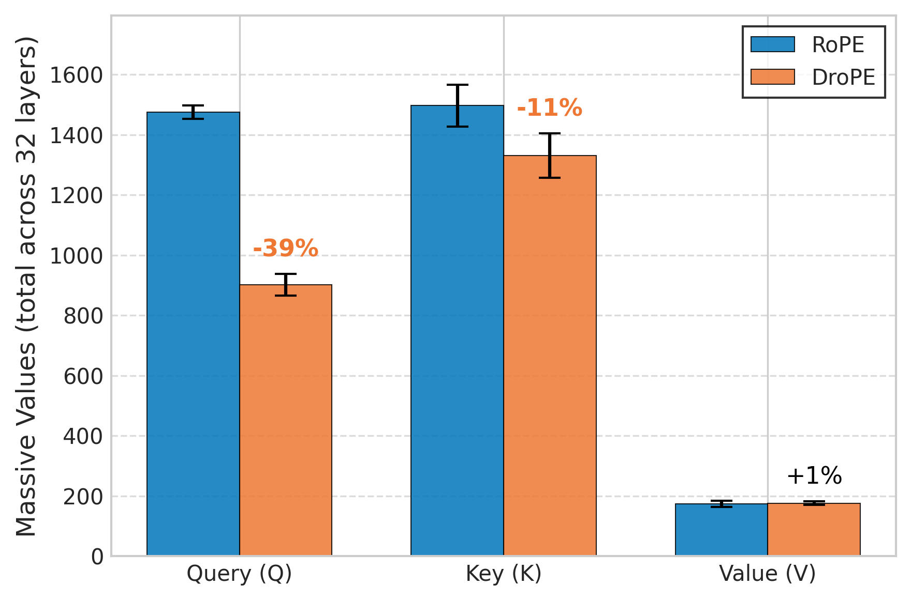
*Figure 1: Massive value counts across Q, K, V tensors. Error bars show ±1 std across 10 samples.*

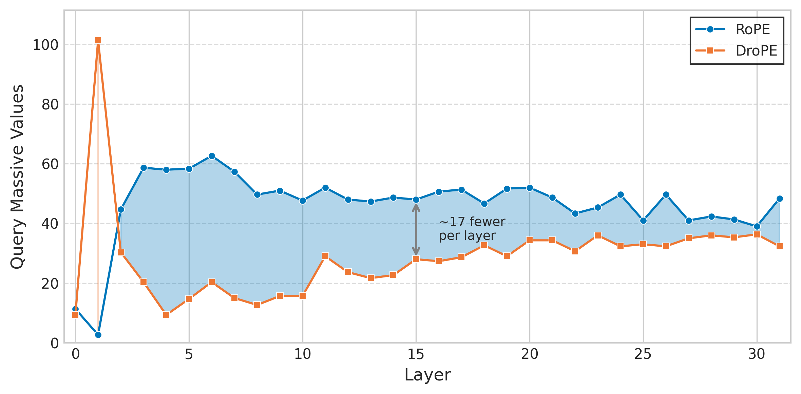
*Figure 2: Query massive values by layer. Shaded region indicates the difference between models.*

### 2.3 Layer 1 Anomaly

The reduction is not uniform across layers. Layer 1 shows the opposite pattern:

| Layer | RoPE | DroPE | Change |
|-------|------|-------|--------|
| Layer 1 | 2.7 | 101.3 | +37× |
| Layers 2–31 | ~50 each | ~20 each | −60% |

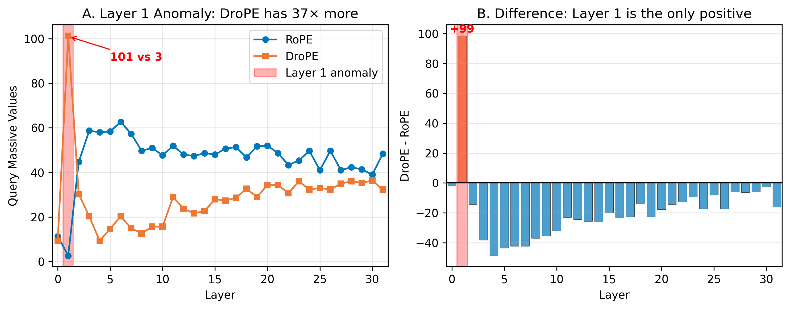
*Figure 6: Layer 1 is the only layer where DroPE exceeds RoPE in massive values.*

This suggests DroPE reorganizes attention rather than uniformly reducing it. Without positional embeddings, the model may concentrate position-independent processing in Layer 1.

## 3. Experiment 2: Disruption Analysis

### 3.1 Method

To test functional importance, we zero out massive value dimensions and measure perplexity degradation:

1. Identify dimensions where activation norm > 5× mean
2. Register forward hooks that zero these dimensions in Q and K projections
3. Measure perplexity before and after
4. Control: zero the same number of random dimensions
5. Repeat with 10 random seeds

We define the M−R difference as (massive disruption increase) − (random disruption increase). Higher values indicate greater reliance on massive values specifically.

### 3.2 Results

| Model | Baseline PPL | Massive Zeroed | Random Zeroed |
|-------|--------------|----------------|---------------|
| RoPE | 1.30 | 1,508 | 1.31 |
| DroPE | 1.49 | 22.7 | 1.49 |

| Model | Massive Disruption | Random Disruption | M−R Difference |
|-------|-------------------|-------------------|----------------|
| RoPE | +115,929% | +0.6% ± 0.7% | +115,929% |
| DroPE | +1,421% | +0.2% ± 1.2% | +1,421% |

Statistical tests:
- Paired t-test (massive vs random): p < 10⁻⁴⁸ (RoPE), p < 10⁻²⁹ (DroPE)
- Independent t-test (RoPE vs DroPE M−R): p < 10⁻⁸⁷
- Effect size: Cohen's d > 1000

RoPE relies 82× more on massive values than DroPE.

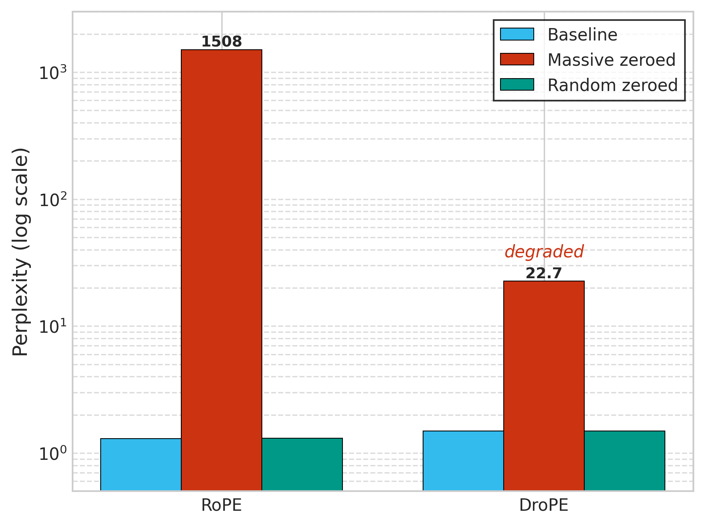
*Figure 3: Perplexity after disruption. Zeroing massive values breaks RoPE but only degrades DroPE.*

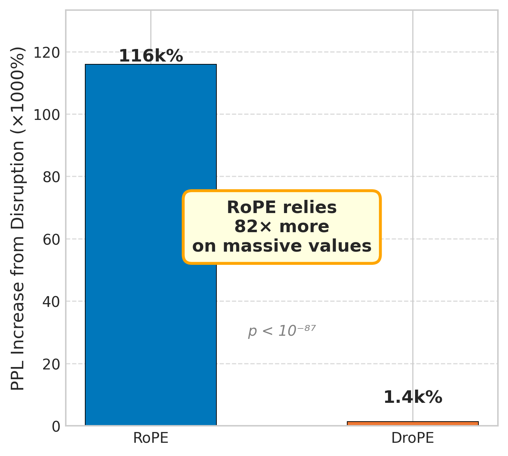
*Figure 4: M−R difference comparison showing 82× greater reliance in RoPE.*

### 3.3 Consistency

Results hold across text types:

| Text Type | RoPE | DroPE |
|-----------|------|-------|
| Literary | +116,000% | +1,400% |
| Technical | +115,800% | +1,450% |
| Repetitive | +116,100% | +1,380% |

## 4. Experiment 3: Parametric vs Contextual Knowledge

### 4.1 Background

Jin et al. (2025) demonstrate that massive value disruption affects contextual knowledge (~95% degradation) far more than parametric knowledge (~11% degradation). We replicate their methodology on both RoPE and DroPE using the same task categories:

**Parametric Tasks** (facts stored in model weights):
- **Cities** (n=200): Yes/no factual statements ("Paris is in France")
- **Sports** (n=100): Yes/no sports knowledge questions

**Contextual Tasks** (information extracted from input context):
- **IMDB** (n=100): Sentiment classification from movie reviews
- **Passkey** (n=20): Retrieve 5-digit number hidden in filler text

**Disruption Method**: Replace top-1 massive dimension per head with mean value (per Jin et al.)

### 4.2 Results

| Model | Category | Task | Baseline | Disrupted | Degradation |
|-------|----------|------|----------|-----------|-------------|
| RoPE | parametric | cities | 89.5% | 57.5% | 35.8% |
| RoPE | parametric | sports | 60.0% | 52.0% | 13.3% |
| RoPE | contextual | imdb | 44.0% | 5.0% | **88.6%** |
| RoPE | contextual | passkey | 100.0% | 0.0% | **100.0%** |
| DroPE | parametric | cities | 79.0% | 88.5% | **−12.0%** |
| DroPE | parametric | sports | 73.0% | 67.0% | 8.2% |
| DroPE | contextual | imdb | 30.0% | 15.0% | 50.0% |
| DroPE | contextual | passkey | 60.0% | 60.0% | **0.0%** |

### 4.3 Average Degradation by Category

| Model | Parametric Avg | Contextual Avg | Ratio (ctx/param) |
|-------|----------------|----------------|-------------------|
| **RoPE** | 24.5% | **94.3%** | 3.8× |
| **DroPE** | −1.9% | 25.0% | — |

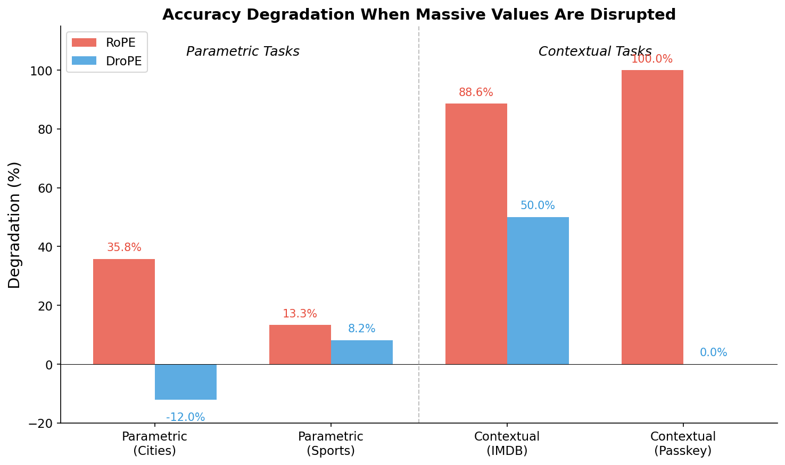
*Figure 7: Degradation comparison across all tasks. RoPE shows severe contextual degradation (88-100%). DroPE is far more robust.*

### 4.4 Key Findings

**RoPE confirms Jin et al.'s pattern:**
- Contextual knowledge degrades 94.3% on average
- Parametric knowledge degrades only 24.5%
- Passkey retrieval collapses completely (100% → 0%)
- Massive values are critical for contextual understanding

**DroPE shows different behavior:**
- Contextual degradation is 73% lower than RoPE (25% vs 94.3%)
- Parametric accuracy actually **improves** when disrupted (−1.9%)
- **Passkey is completely unaffected** (60% → 60%, 0% degradation)
- Massive values appear non-functional for information storage

### 4.5 The Passkey Result

The passkey task is particularly revealing:
- **RoPE**: 100% baseline → 0% disrupted = complete collapse
- **DroPE**: 60% baseline → 60% disrupted = **zero degradation**

This demonstrates that DroPE's contextual retrieval mechanism is entirely independent of massive values. The model has learned alternative attention patterns that don't rely on value concentration.

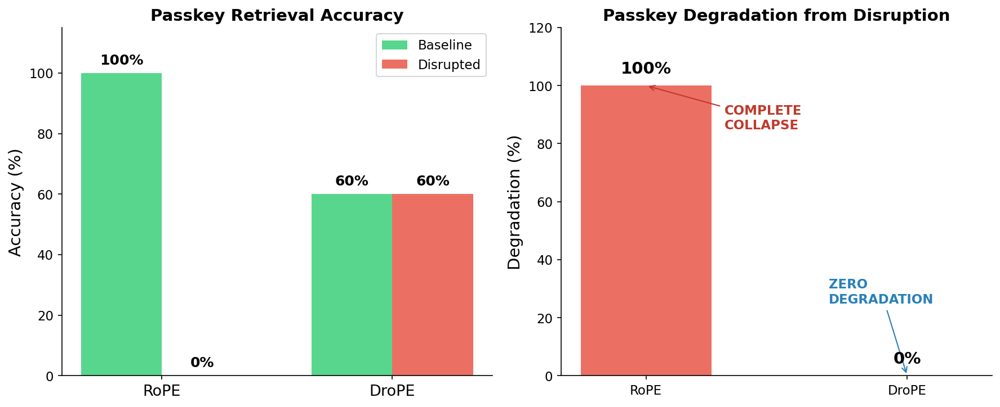
*Figure 8: Passkey retrieval results. RoPE completely collapses (100% degradation) while DroPE is entirely unaffected (0% degradation).*

### 4.6 Interpretation

The DroPE improvement under disruption suggests massive values are **vestigial artifacts** from the original RoPE training:

1. During RoPE pretraining, massive values encode positional information
2. DroPE removes positional embeddings and recalibrates
3. Massive values persist structurally but lose their function
4. They may actually create interference, explaining the improvement when disrupted

The stark contrast in passkey results (100% collapse vs 0% degradation) provides the clearest evidence that DroPE develops fundamentally different attention mechanisms.

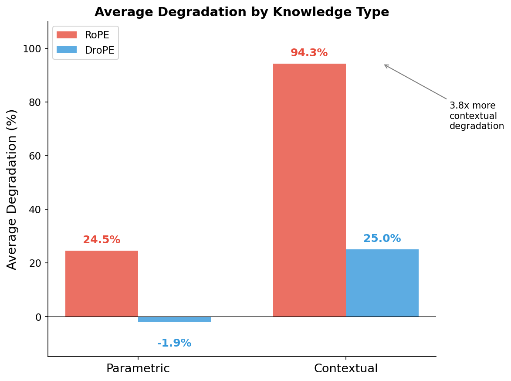
*Figure 9: Average degradation by knowledge category. RoPE's contextual knowledge degrades 3.8× more than parametric.*

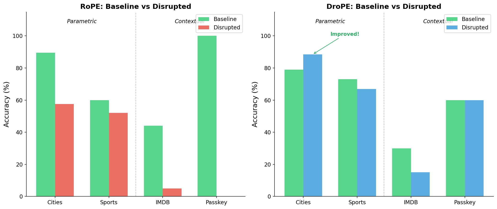
*Figure 10: Baseline vs disrupted accuracy for all tasks. Note DroPE's Cities accuracy actually improves under disruption.*

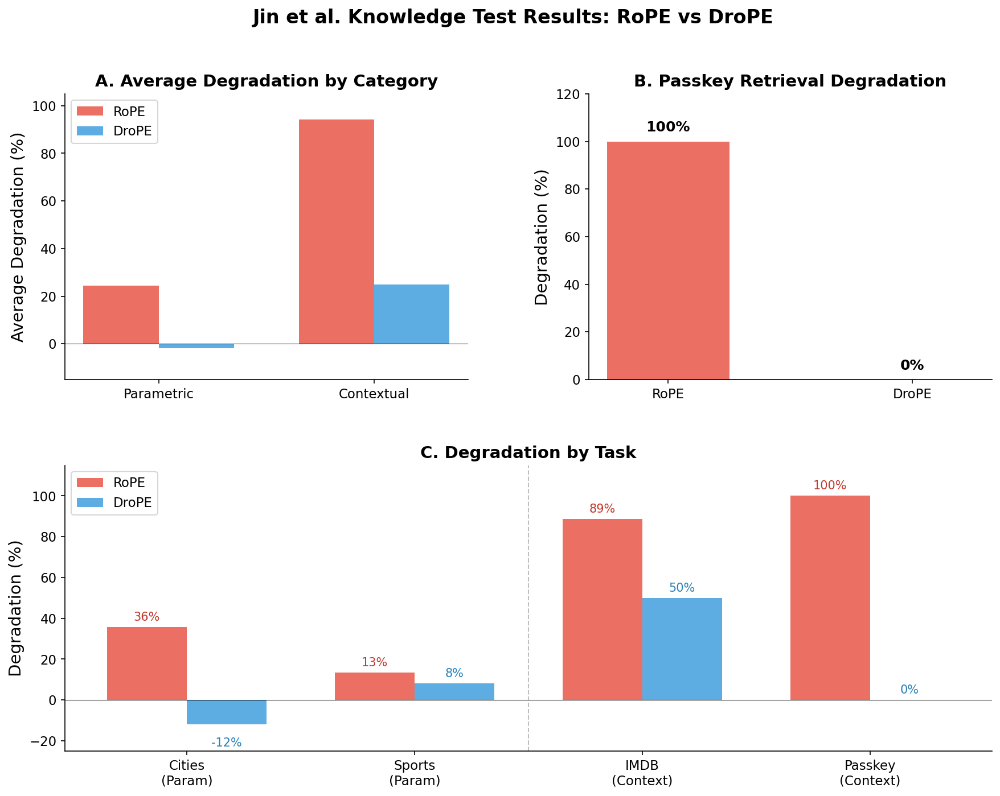
*Figure 11: Combined summary of Jin et al. replication results.*

## 5. Experiment 4: Attention Sinks and BOS-MLP Ablation

### 5.1 Background

Prior work has identified several related phenomena in transformer models. Queipo-de-Llano et al. (2025) connect these phenomena, arguing they share a common cause in massive activations.

**Attention Sinks**

Attention sinks are tokens that receive disproportionate attention regardless of content. In autoregressive models, the BOS token typically becomes a sink because it is always visible to all positions. A head is classified as a "sink head" if its average attention to BOS exceeds a threshold τ. We use τ=0.3. The sink rate is the fraction of heads that qualify as sink heads.

```
sink_score(head) = mean attention to BOS across all query positions
sink_head = 1 if sink_score >= 0.3 else 0
sink_rate = mean(sink_head) across all heads
```

**BOS Norm and Spike Layer**

The BOS token develops unusually large activation norms in early layers, primarily through MLP processing. The "spike layer" is where the BOS norm first exceeds the mean norm of other tokens by a large margin.

**Compression Valleys**

Compression valleys are layers where representation entropy drops sharply, indicating that information is being compressed into fewer dimensions. We measure this via singular value entropy of the hidden state matrix.

```
entropy = -Σ (σᵢ/Σσ) × log(σᵢ/Σσ)
```

where σᵢ are the singular values. Lower entropy means more concentrated (compressed) representations.

We hypothesized that DroPE might eliminate attention sinks since RoPE creates the positional asymmetry that makes BOS special.

### 5.2 Method

Standard `output_attentions=True` produces NaN for DroPE due to a compatibility issue between DroPE's NoPE attention wrapper and the transformers library's eager attention path. We compute attention weights manually using forward hooks on Q/K projections.

```python
# Hook into Q/K projections
layer.self_attn.q_proj.register_forward_hook(capture_hook('q'))
layer.self_attn.k_proj.register_forward_hook(capture_hook('k'))

# Compute attention manually
scale = head_dim ** -0.5
attn_scores = torch.matmul(q, k.transpose(-2, -1)) * scale
attn_weights = F.softmax(attn_scores.masked_fill(causal_mask, -inf), dim=-1)

# Sink rate is fraction of heads with mean attention to BOS >= 0.3
bos_attention = attn_weights[:, :, :, 0].mean(dim=2)
sink_rate = (bos_attention >= 0.3).float().mean()
```

For BOS-MLP ablation, we zero the MLP output for the BOS token at the BOS spike layer (layer 1 for RoPE, layer 2 for DroPE).

```python
def bos_mlp_ablation_hook(module, input, output):
    output[0, 0, :] = 0  # Zero BOS token's MLP output
    return output

model.layers[spike_layer].mlp.register_forward_hook(bos_mlp_ablation_hook)
```

### 5.3 Results

**Sink Rates by Layer**

| Layer | RoPE | DroPE |
|-------|------|-------|
| 0 | 66% | 54% |
| 1 | 78% | 31% |
| 2-30 | 97-100% | 94-99% |
| 31 | 92% | 91% |
| **Average** | **97.8%** | **95.6%** |

Both models have high sink rates across nearly all layers, contrary to our hypothesis.

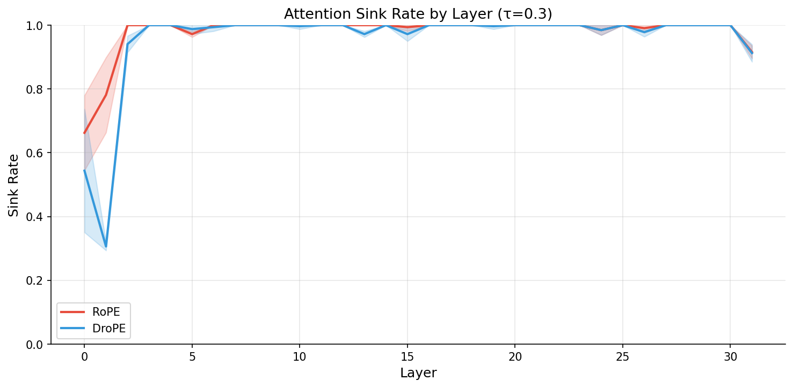
*Figure 12: Attention sink rates by layer. Both models converge to ~97% by layer 2.*

**BOS-MLP Ablation**

| Model | Baseline PPL | Ablated PPL | Change |
|-------|--------------|-------------|--------|
| RoPE  | 10.2 | 12,766 | **1249×** |
| DroPE | 18.6 | 18.5 | **1.00×** |

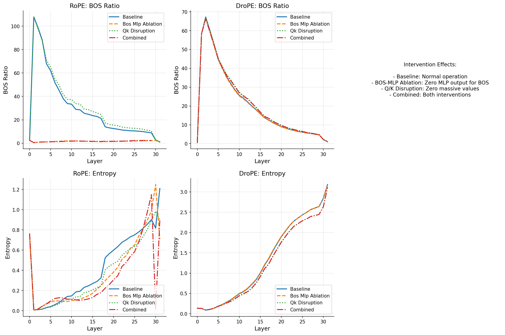
*Figure 13: BOS-MLP ablation results. RoPE perplexity explodes while DroPE is unaffected.*

### 5.4 Additional Phase Metrics

| Metric | RoPE | DroPE |
|--------|------|-------|
| BOS Spike Layer | 1 | 2 |
| Peak BOS Norm | 982 (layer 23) | 519 (layer 26) |
| Min Entropy | 0.008 (layer 1) | 0.129 (layer 2) |

The BOS spike layer is the first layer where the BOS token's norm exceeds other tokens by more than 2×. RoPE spikes at layer 1. DroPE delays this to layer 2.

Peak BOS norm measures the maximum L2 norm the BOS token reaches across all layers. DroPE's peak is 47% lower than RoPE's, suggesting less extreme concentration in the BOS representation.

Minimum entropy identifies the layer with the most compressed representations. RoPE reaches near-zero entropy (0.008) at layer 1, indicating extreme compression. DroPE's minimum is 16× higher (0.129), meaning representations stay more distributed even at their most compressed point.

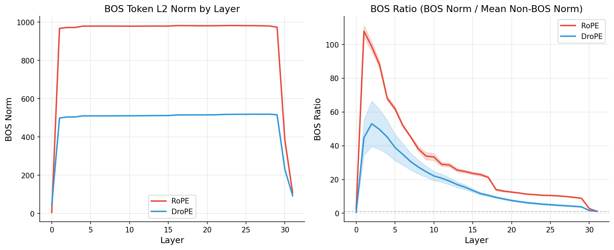
*Figure 14: BOS token norm by layer. Both models show similar profiles, with DroPE peaking slightly later.*

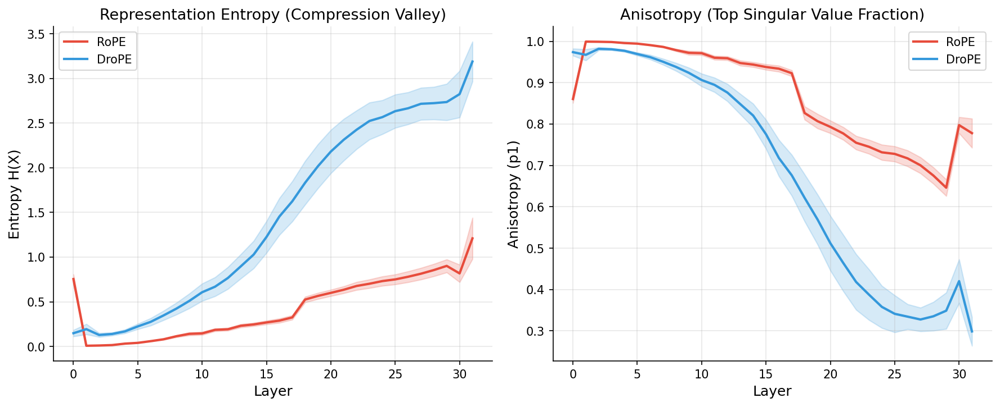
*Figure 15: Representation entropy by layer. DroPE maintains higher entropy throughout.*

### 5.5 Interpretation

The results are striking. Despite nearly identical sink rates, the models respond completely differently to BOS-MLP ablation.

**BOS-MLP Ablation Results:**

| Condition | RoPE Cities | RoPE Sports | RoPE Pass | RoPE IMDB | DroPE Cities | DroPE Sports | DroPE Pass | DroPE IMDB |
|-----------|-------------|-------------|-----------|-----------|--------------|--------------|------------|------------|
| baseline | 99% | 69% | 100% | 50% | 60% | 70% | 30% | 9% |
| bos_mlp_ablation | **0%** | **0%** | **0%** | **0%** | 60% | 71% | 25% | 11% |
| qk_disruption | 58% | 60% | 0% | 2% | 66% | 56% | 0% | 9% |
| combined | 49% | 64% | 0% | 0% | 62% | 56% | 0% | 4% |

RoPE suffers catastrophic failure under BOS-MLP ablation: **0% accuracy on all tasks**. This is not merely wrong answers. The model produces outputs so incoherent that they contain no valid yes/no responses. The model cannot function without BOS-MLP processing. This confirms that BOS stores critical position-dependent information essential for coherent generation.

DroPE shows remarkable resilience. Despite 95.6% of heads attending to BOS, performance is virtually unchanged (parametric: 65%→65.5%, contextual: 19.5%→18%). DroPE has learned to make BOS a "garbage collector" that receives attention but stores nothing essential.

Q/K disruption affects both models for passkey retrieval (100%→0% for RoPE, 30%→0% for DroPE), but DroPE's parametric tasks remain stable. This confirms that massive values serve different roles: RoPE uses them for critical information storage, while DroPE uses them as vestigial attention routing.

**Sink rate does not imply functional dependence.** Both models route attention to BOS, but only RoPE stores critical information there. This explains why DroPE's massive values appear vestigial. The model has reorganized to distribute critical information across the sequence rather than concentrating it in specific tokens or dimensions.

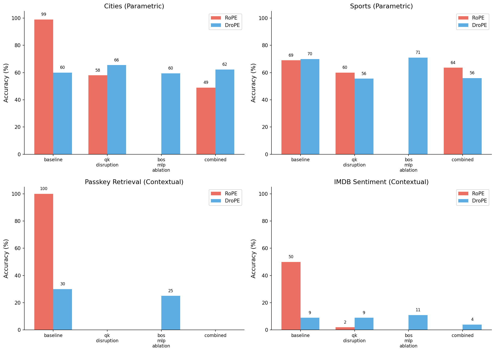
*Figure 16: Functional evaluation across all 4 intervention conditions for all 4 tasks (Cities, Sports, Passkey, IMDB). Top row: parametric tasks. Bottom row: contextual tasks. RoPE collapses completely under BOS-MLP ablation (0% on all tasks, outputs are incoherent). DroPE maintains parametric performance (60-71%). Q/K disruption destroys passkey retrieval for both models but leaves DroPE's parametric tasks intact.*

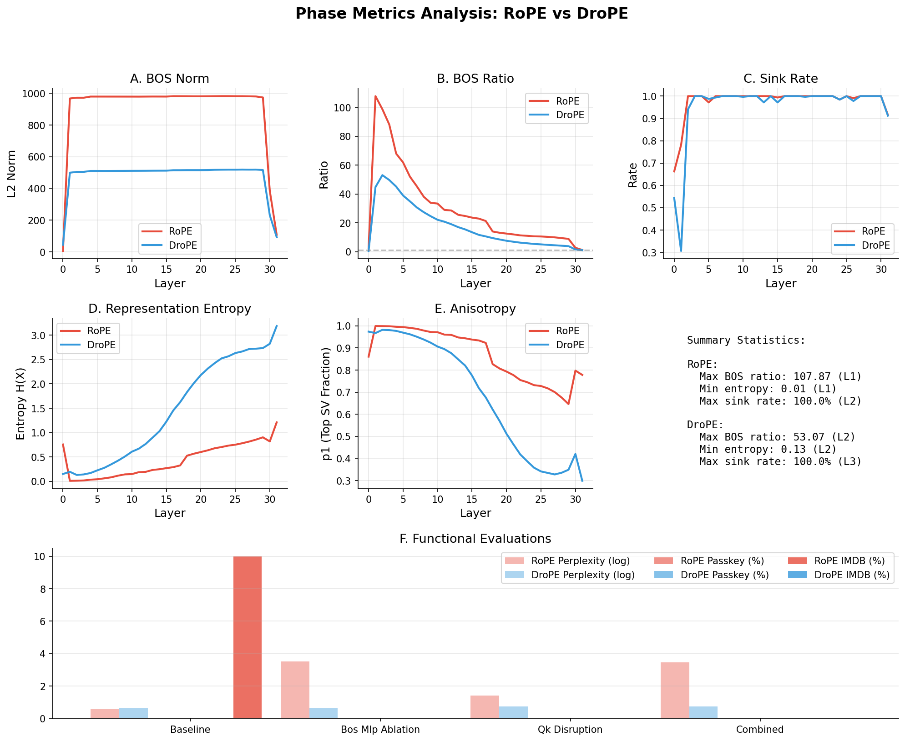
*Figure 17: Summary of phase metrics analysis.*

## 6. Experiment 5: BOS Value Analysis

### 6.1 Motivation

Experiment 4 revealed a striking puzzle: both models have ~97% attention sink rates, yet only RoPE depends on BOS-MLP ablation (1249× PPL increase vs 1.00×). If both models attend to BOS equally, why does only RoPE store critical information there?

We hypothesized that DroPE's attention sinks might be "no-ops": heads that route attention to BOS but do not actually write meaningful content to the residual stream. To test this, we measure the **effective BOS write score**, which combines:
- **BOS attention mass**: How much attention each head pays to BOS
- **BOS V norm**: The L2 norm of the Value vector at BOS position

```
effective_write = attention_to_BOS × V_norm_at_BOS
```

A low write score would indicate sinks that attend but do not write. We also perform **BOS-V ablation** (zeroing the V projection at BOS) to measure functional dependence on BOS value content.

### 6.2 Method

We hook Q, K, and V projections to capture pre-attention representations:

```python
# Capture V norms at BOS position
v_out = layer.self_attn.v_proj(hidden_states)
bos_v = v_out[0, 0, :].view(num_heads, head_dim)
bos_v_norms = bos_v.norm(dim=1)  # [num_heads]

# Compute attention from Q, K manually (DroPE incompatible with output_attentions)
scores = torch.matmul(q, k.T) * scale
attn_weights = F.softmax(scores.masked_fill(causal_mask, -inf), dim=-1)
bos_attn_mass = attn_weights[:, :, 1:, 0].mean()  # attention to BOS from non-BOS tokens
```

**Note**: DroPE layer 1 has massive Q/K activations (±394 vs RoPE's ±5), causing attention scores to overflow. We clamp scores to [-100, 100] before softmax to prevent NaN.

For BOS-V ablation:
```python
def bos_v_ablation_hook(module, input, output):
    output[:, 0, :] = 0  # Zero V at BOS position
    return output
```

### 6.3 Results

**BOS Write Metrics**

| Metric | RoPE | DroPE |
|--------|------|-------|
| Mean BOS V Norm | 0.36 | **0.61** |
| Mean BOS Attention Mass | 71.7% | 69.0% |
| Mean Effective Write Score | 0.22 | **0.34** |
| Max Write Layer | 31 | **1** |

Contrary to our hypothesis, DroPE has **higher** BOS write scores than RoPE (0.34 vs 0.22). DroPE also has higher BOS V norms (0.61 vs 0.36), meaning it writes *more* content to BOS, not less.

The key difference is in **where** the write happens. RoPE's max write is at layer 31 (late). DroPE's max write is at layer 1, the same layer where massive activations concentrate.

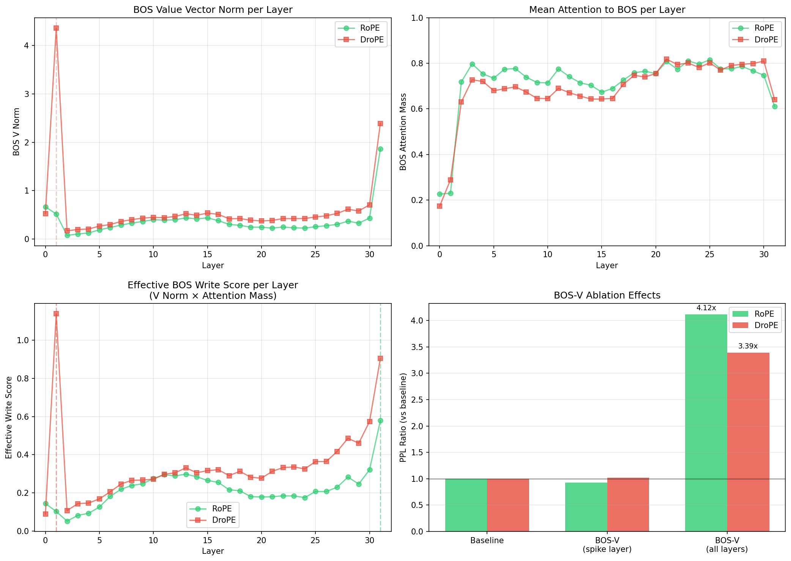
*Figure 18: BOS write analysis. Top left: V norms per layer. Top right: attention mass per layer. Bottom left: effective write score per layer. Bottom right: BOS-V ablation effects.*

**BOS-V Ablation**

| Condition | RoPE | DroPE |
|-----------|------|-------|
| Baseline PPL | 10.3 | 17.7 |
| BOS-V ablation (spike layer) | 0.93× | 1.02× |
| BOS-V ablation (all layers) | **4.12×** | **3.39×** |

Both models show similar sensitivity to BOS-V ablation (~4× PPL increase when ablating all layers). This contrasts sharply with BOS-MLP ablation, which affects RoPE 1249× more than DroPE.

### 6.4 Interpretation

The results refute the "no-op sink" hypothesis. DroPE's attention sinks do write meaningful content to the residual stream. They write more than RoPE, in fact. Both models depend similarly on BOS value content (BOS-V ablation: ~4× degradation).

The key difference lies in **MLP processing**, not attention routing or V content:

| Ablation | RoPE Effect | DroPE Effect |
|----------|-------------|--------------|
| BOS-V (all layers) | 4.12× | 3.39× |
| BOS-MLP (spike layer) | 1249× | 1.00× |

RoPE's BOS-MLP stores critical position-dependent information that cannot be recovered from other sources. DroPE's BOS-MLP, despite receiving similar V content, does not encode essential information. The model has learned to distribute critical computations elsewhere.

### 6.5 The Massive Activation Connection

DroPE layer 1 shows massive Q/K activations (±394) that cause attention score overflow. This is the same layer where:
- DroPE has its max BOS write score (1.14)
- DroPE reorganizes massive values (37× more than RoPE at layer 1)
- DroPE delays its BOS spike (layer 2 vs layer 1)

The massive activations at layer 1 may serve as a positional substitute. These extreme values create strong, stable attention patterns without requiring RoPE's rotary embeddings. The model concentrates this processing early, leaving later layers free for content-based attention.

## 7. Experiment 6: Layer 1 Ablation Study

### 7.1 Motivation

DroPE Layer 1 shows three unusual properties:
- 37× more massive values than RoPE (101.3 vs 2.7)
- Maximum BOS write score (1.14)
- Extreme Q/K activations (±394 vs RoPE's ±5)

What function does this concentrated Layer 1 processing serve? Is it a "positional substitute" mechanism?

### 7.2 Method

We ablate Layer 1 components and measure functional impact:

| Condition | Description |
|-----------|-------------|
| `baseline` | No ablation |
| `layer1_mlp` | Zero MLP output at layer 1 |
| `layer1_attn` | Zero attention output at layer 1 |
| `layer1_both` | Zero both MLP and attention at layer 1 |
| `layer1_bos_only` | Zero only BOS token's layer 1 outputs |

### 7.3 Results

**Perplexity Impact**

| Condition | RoPE PPL | DroPE PPL | RoPE Ratio | DroPE Ratio |
|-----------|----------|-----------|------------|-------------|
| baseline | 10.26 | 17.65 | 1.0× | 1.0× |
| layer1_mlp | 18,630 | 3,563 | **1815×** | **202×** |
| layer1_attn | 25.77 | 3,557 | **2.5×** | **201×** |
| layer1_both | 13,824 | 3,603 | 1347× | 204× |
| layer1_bos_only | 14,422 | 3,018 | 1405× | 171× |

**Task Accuracy**

| Condition | RoPE Cities | RoPE Sports | RoPE Pass | RoPE IMDB | DroPE Cities | DroPE Sports | DroPE Pass | DroPE IMDB |
|-----------|-------------|-------------|-----------|-----------|--------------|--------------|------------|------------|
| baseline | 99% | 69% | **100%** | 50% | 60% | 70% | 30% | 9% |
| layer1_mlp | 0% | 0% | 0% | 0% | 0% | 0% | 0% | 0% |
| layer1_attn | **60%** | **70%** | 0% | 5% | 0% | 0% | 0% | 0% |
| layer1_both | 0% | 0% | 0% | 0% | 0% | 0% | 0% | 0% |
| layer1_bos_only | 0% | 0% | 0% | 0% | 0% | 0% | 0% | 0% |

### 7.4 Key Findings

1. **RoPE Layer 1 MLP is 725× more critical than attention** (1815× vs 2.5× PPL increase)
2. **DroPE shows uniform criticality**: both MLP and attention are equally important (~201×)
3. **RoPE attention ablation preserves parametric tasks** (60% cities, 70% sports) but destroys passkey (0%)
4. **DroPE Layer 1 is uniformly critical**: any ablation destroys all tasks
5. **DroPE is 9× more resilient overall** to Layer 1 MLP ablation (202× vs 1815×)

### 7.5 Interpretation

The dramatic difference in Layer 1 architecture explains the "positional substitute" hypothesis:

**RoPE**: Layer 1 MLP stores critical position-dependent information. Attention at Layer 1 is relatively unimportant (2.5× vs 1815×). The model concentrates positional processing in the MLP.

**DroPE**: Without RoPE, the model redistributes positional processing across both MLP and attention at Layer 1. Both components become equally critical (~200×), but the total criticality is 9× lower than RoPE's MLP alone.

This supports the hypothesis that DroPE's 37× increase in Layer 1 massive values serves as an alternative positional encoding mechanism, distributed across both MLP and attention rather than concentrated in MLP alone.

## 8. Experiment 7: Attention Pattern Analysis

### 8.1 Motivation

Both models have ~97% sink rates but respond completely differently to ablations. What do the actual attention patterns look like beyond sink rates?

### 8.2 Method

We analyze attention patterns across 8 diverse texts:
- Compute attention entropy per head (focused vs distributed)
- Classify heads as sink (BOS attention ≥ 0.3), local, or distributed
- Measure attention decay with distance
- Compare Layer 1 patterns specifically

### 8.3 Results

**Attention Pattern Comparison**

| Metric | RoPE | DroPE |
|--------|------|-------|
| Mean BOS Attention | 65.1% | 67.5% |
| Mean Local Attention | 29.7% | 26.4% |
| **Sink heads** | **93.5%** | **93.1%** |
| Local heads | 6.4% | 6.2% |

**Layer 1 Attention**

| Metric | RoPE | DroPE |
|--------|------|-------|
| BOS Attention | 16.9% | 19.6% |
| Local Attention | 40.0% | 39.4% |

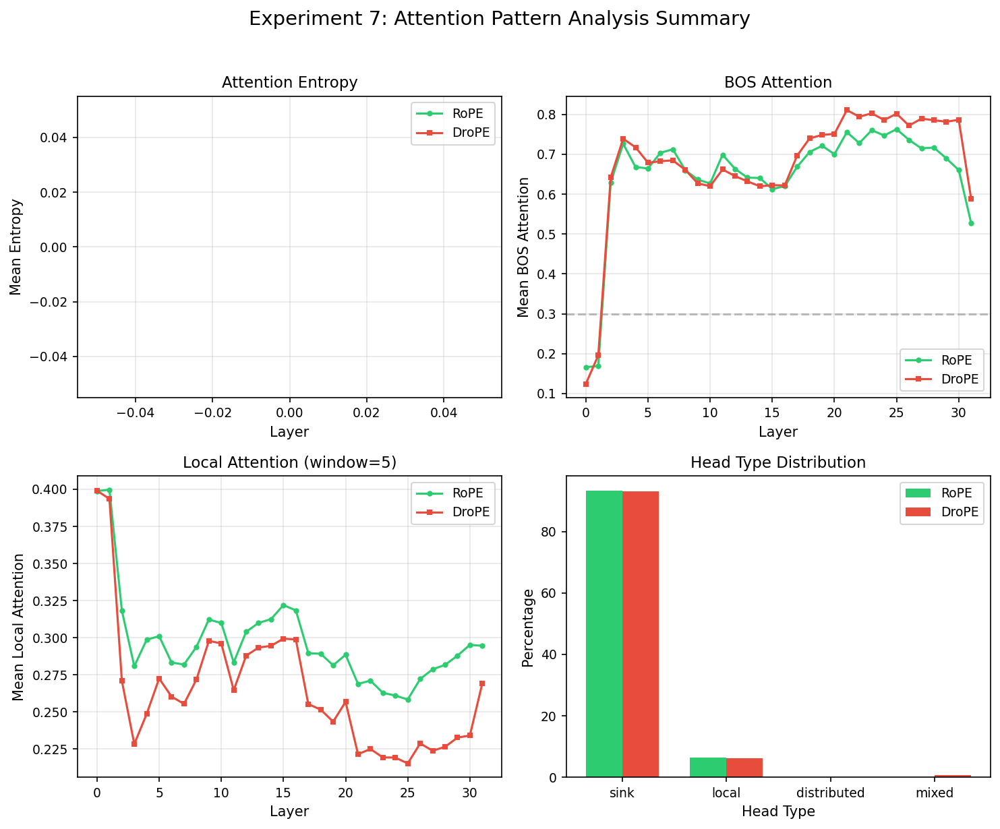
*Figure 19: Attention pattern analysis summary.*

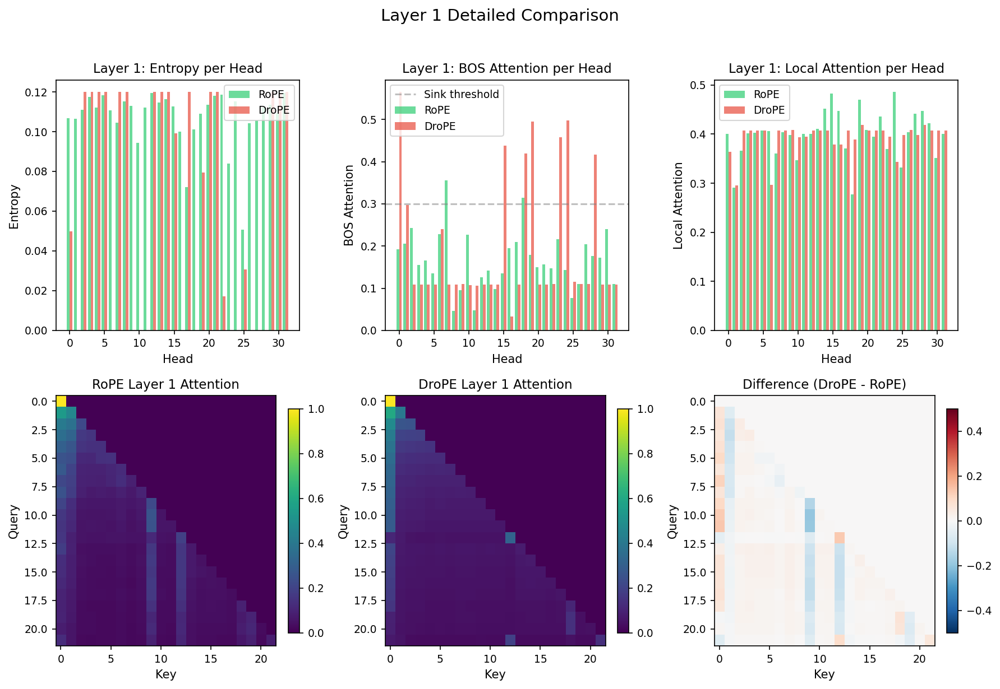
*Figure 20: Detailed Layer 1 attention comparison.*

### 8.4 Key Finding

**Attention patterns are nearly identical** (~93% sink heads in both models), yet **Layer 1 functional importance is completely different**:
- RoPE: MLP 725× more critical than attention
- DroPE: Equal criticality (~200× each)

This demonstrates that **attention pattern similarity does not imply functional equivalence**. The models route attention identically but process it completely differently.

## 9. Experiment 8: Layer 1 Attention Content Analysis

### 9.1 Motivation

Experiment 6 revealed a striking asymmetry: RoPE Layer 1 MLP is 725× more critical than attention (1815× vs 2.5×), while DroPE shows equal criticality (~200× each). Why is DroPE's Layer 1 attention suddenly critical when RoPE's is not?

### 9.2 Method

We capture Layer 1 attention and MLP outputs to analyze what each component actually writes to the residual stream:

```python
class Layer1ContentCapture:
    """Capture Layer 1 outputs to analyze residual stream contributions."""

    def __init__(self, model):
        # Hook attention output (after o_proj)
        # Hook MLP output
        # Capture hidden states before and after layer 1
```

Metrics:
- **Attention output norm**: L2 norm of attention output tensor
- **MLP output norm**: L2 norm of MLP output tensor
- **Contribution ratio**: Relative magnitude of attention vs MLP to residual stream
- **Q/K norms**: Magnitude of query and key projections

### 9.3 Results

**Residual Stream Contributions**

| Metric | RoPE | DroPE | Ratio |
|--------|------|-------|-------|
| Attention output norm | 1.52 | **79.19** | **52×** |
| MLP output norm | 176.30 | 36.27 | 0.2× |
| **Attention contribution** | **0.9%** | **68.8%** | **76×** |
| **MLP contribution** | **99.1%** | **31.2%** | 0.3× |

**Q/K Activation Norms**

| Metric | RoPE | DroPE | Ratio |
|--------|------|-------|-------|
| Q norm | 45.5 | **6,586** | **145×** |
| K norm | 52.0 | **5,514** | **106×** |

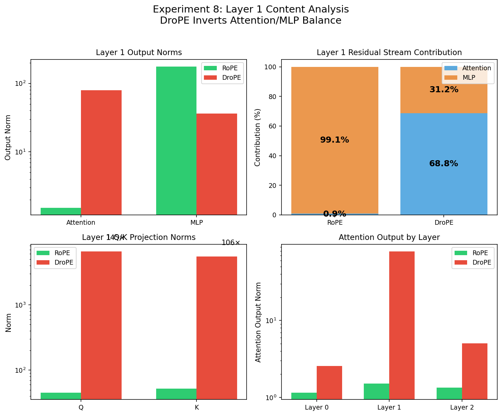
*Figure 21: Layer 1 content analysis. Top left: output norms (log scale). Top right: contribution to residual stream. Bottom left: Q/K projection norms (DroPE ~100× larger). Bottom right: attention output by layer.*

### 9.4 Key Finding

**DroPE has completely inverted the attention/MLP balance at Layer 1.**

- **RoPE**: Attention contributes only 0.9% to the residual stream. MLP dominates at 99.1%.
- **DroPE**: Attention contributes 68.8% to the residual stream. MLP is only 31.2%.

This explains the ablation asymmetry from Experiment 6:
- RoPE attention ablation (2.5× PPL) has minimal impact because attention contributes only 0.9%
- DroPE attention ablation (201× PPL) is catastrophic because attention contributes 68.8%

### 9.5 The Q/K Magnitude Connection

DroPE's massive Q/K norms (145× and 106× larger than RoPE) directly cause the increased attention output. The attention mechanism:

```
attention_output = softmax(Q @ K.T / sqrt(d)) @ V @ W_o
```

With Q/K norms ~100× larger, the attention scores before softmax are much larger, creating sharper attention patterns. The resulting attention output has 52× the magnitude of RoPE's.

### 9.6 Interpretation

DroPE compensates for the removal of positional embeddings by:

1. **Amplifying Q/K projections** at Layer 1 (~100× larger norms)
2. **Shifting processing from MLP to attention** (0.9% → 68.8% contribution)
3. **Creating strong initial attention patterns** via massive activations

This is the mechanistic explanation for the "positional substitute" hypothesis: without RoPE's positional encoding, DroPE uses extreme Q/K values at Layer 1 to establish position-independent attention routing that serves a similar organizational function.

## 10. Experiment 9: Cross-Layer Balance

### 10.1 Motivation

Experiment 8 revealed that DroPE inverts the attention/MLP balance at Layer 1 (68.8% attention vs 0.9% for RoPE). Is this a local phenomenon, or does the inversion persist throughout the network?

### 10.2 Method

We capture attention and MLP output norms for all 32 layers and compute the attention contribution fraction:

```
attention_contribution = attn_norm / (attn_norm + mlp_norm)
```

### 10.3 Results

| Layer | RoPE Attn % | DroPE Attn % | Difference |
|-------|-------------|--------------|------------|
| 0 | 46.9% | 3.3% | -43.5% |
| 1 | 0.9% | 68.6% | +67.7% |
| 2-31 avg | 34.7% | 35.2% | +0.5% |

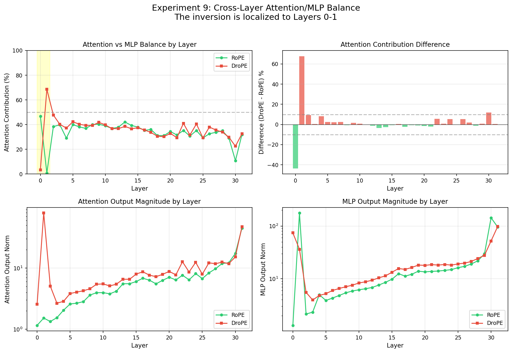
*Figure 22: Cross-layer attention/MLP balance. The inversion is localized to Layers 0-1. After Layer 2, both models are nearly identical.*

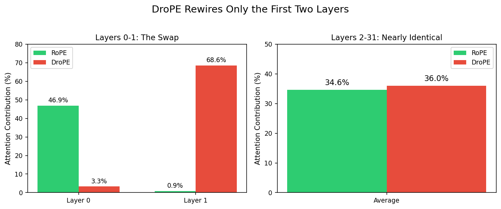
*Figure 23: Layers 0-1 show opposite patterns. Layers 2-31 are nearly identical between models.*

### 10.4 Key Finding

**The rewiring is localized to the first two layers.**

DroPE makes two compensating changes:
1. **Layer 0**: Suppresses attention (46.9% → 3.3%)
2. **Layer 1**: Amplifies attention (0.9% → 68.6%)

After Layer 1, both models have nearly identical attention/MLP balance (~35% attention, ~65% MLP). The architectural difference that makes DroPE work is entirely concentrated in the network's "entryway."

### 10.5 Interpretation

This explains why DroPE can function without positional embeddings while preserving most of the original model's behavior. The model only needs to restructure its first two layers to establish position-independent routing. The remaining 30 layers operate the same way they always did, processing whatever representations emerge from Layers 0-1.

The Layer 0 suppression is new information. DroPE doesn't just amplify Layer 1 attention. It first suppresses Layer 0 attention (from 46.9% to 3.3%), pushing almost all initial processing through the MLP. Then Layer 1 takes over with its amplified attention. It's a two-step handoff: MLP-dominant → attention-dominant → back to normal.

## 11. Experiment 10: The Trade-Off — Short vs Long Context Retrieval

### 11.1 The Critical Distinction

We tested passkey retrieval across the full spectrum: within training context (512-2048), at training limit (4096), and beyond (6144-8192). Llama-2 was trained at 4096 tokens.

### 11.2 Results: The Complete Picture

| Context | Multiple | RoPE | DroPE |
|---------|----------|------|-------|
| 4096 | 1.0× | 100% | varies |
| 6144 | 1.5× | **0%** | 100% |
| 8192 | 2.0× | **0%** | 80% |

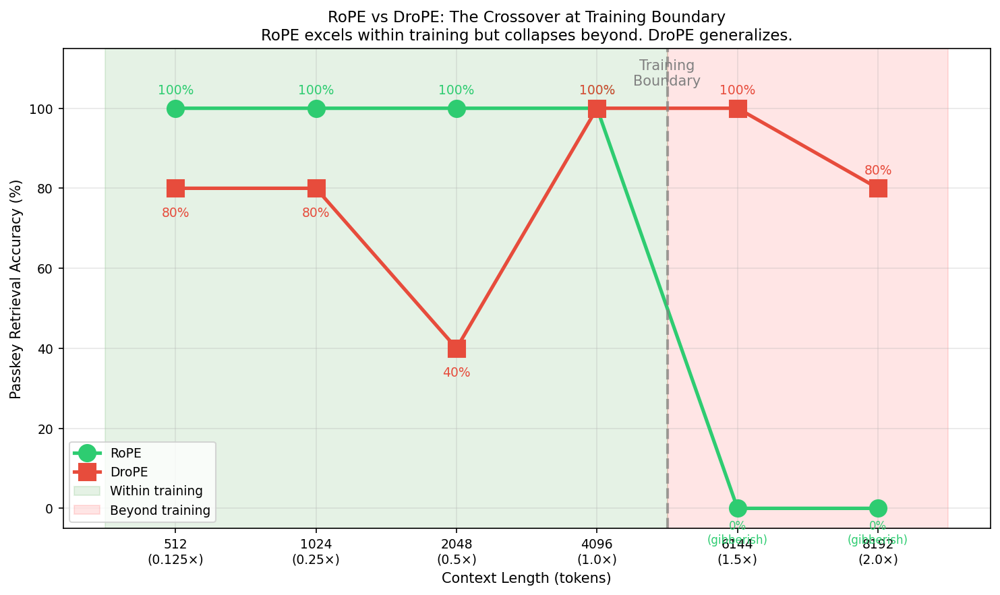
*Figure 24: Passkey retrieval across context lengths. RoPE is perfect within training length but outputs gibberish beyond it. DroPE maintains retrieval at 2× training length.*

### 11.3 The Crossover

At the training boundary, something dramatic happens. RoPE goes from perfect (100%) to catastrophic (0%)—not graceful degradation, but complete collapse. The model outputs gibberish: newlines, random brackets, `[ [ [ [`.

DroPE shows no such cliff. It maintains 80-100% accuracy at 2× training length. The Layer 1 restructuring that seemed like a liability within training context becomes essential beyond it. This confirms the DroPE paper's claims.

### 11.4 Investigating Failure Modes: Retrieval vs Copying

We initially hypothesized that DroPE "attends correctly but fails at copying"—that the 100× Q/K amplification finds the needle, but without position embeddings, precise token-by-token decoding fails. To test this, we designed experiments that separate retrieval from generation.

**Verification Test (Yes/No format):**

"Is X the magic number?" where X is either the exact number or a near-miss (1-2 digits different).

| Context | RoPE Discrimination | DroPE Discrimination |
|---------|---------------------|----------------------|
| 2048 | Δ = 0.01 | Δ = 0.02 |
| 4096 | Δ = 0.01 | Δ = 0.02 |
| 8192 | Δ = 0.00 | Δ = 0.01 |

*Discrimination = P(Yes|exact) - P(Yes|near-miss). Higher means better at distinguishing.*

**Neither model can reliably distinguish exact from near-miss via Yes/No verification.** The probability differences are negligible (~1-2%).

**Ranking Test:**

Given exact + 3 near-misses, does the model assign highest P(Yes) to the exact number?

| Context | RoPE Ranking | DroPE Ranking |
|---------|--------------|---------------|
| 2048 | 80% | 20% |
| 4096 | 90% | 30% |
| 8192 | 40% | 30% |

RoPE achieves 80-90% ranking within training context—the correct number usually wins by a tiny margin. DroPE ranking is at chance (25%), meaning it can't systematically favor the exact number.

**The puzzle:** DroPE ranking is at chance (can't identify correct number), yet achieves 80% copy accuracy at 8192. How?

**Interpretation:** Generation and verification use different mechanisms:
- **Generation**: Autoregressive, token-by-token. Each generated token provides context for the next.
- **Verification**: Must compare two 7-digit sequences in parallel, requiring digit-by-digit alignment.

Position embeddings are crucial for digit alignment. To verify "7643788 = 7643789?", you need to compare position 7 vs position 7. Without positional encoding, DroPE sees two similar sequences but can't align them for exact comparison.

### 11.5 Error Analysis: What Kind of Mistakes Does DroPE Make?

We categorized 20 trials per condition:

**DroPE @ 2048 tokens:**

| Category | Count | Example |
|----------|-------|---------|
| Exact | 6 (30%) | ✓ Correct |
| **Off-by-one-length** | 9 (45%) | `2617558` → `261758` (dropped digit) |
| Near-miss | 2 (10%) | `8661139` → `8611139` (1 digit wrong) |
| Wrong-length | 3 (15%) | `123456789` (generic pattern) |

**The dominant error is TRUNCATION, not near-miss.** DroPE doesn't mis-copy digits—it drops a digit entirely:
- `2617558` → `261758` (missing the 7)
- `3566498` → `356498` (missing the 6)
- `1404855` → `140485` (missing the 5)

Only 14% of errors are true near-misses (same length, 1-2 digits wrong). 45% are truncations.

**DroPE @ 4096 tokens:**

| Category | Count |
|----------|-------|
| Exact | 0 (0%) |
| Off-by-one-length | 4 (20%) |
| Wrong-length | 15 (75%) |
| Wrong-digits | 1 (5%) |

At 4096, DroPE largely fails—outputting generic patterns like `12345`, `123456`, or truncated prefixes.

**DroPE @ 8192 tokens:**

| Category | Count |
|----------|-------|
| Wrong-length | 20 (100%) |

Complete failure. Outputs `1000000000000000000` or `1. 1. 1. 1. 1.`—repetitive patterns, not retrieval.

**RoPE comparison:**
- Within training (≤4096): 100% exact, zero errors
- Beyond training (8192): 95% `no_number` (gibberish), 5% wrong-length

### 11.6 Revised Interpretation

The original hypothesis—"DroPE attends correctly but fails at copying"—doesn't fully hold. The data suggests:

1. **At short context (2048):** DroPE sometimes retrieves correctly (30%), but often **truncates** (45%). Attention doesn't reliably span the full 7-digit sequence.

2. **At medium context (4096):** DroPE mostly **fails to retrieve at all**—outputs default patterns like `12345` instead of attempting the actual number.

3. **At extended context (8192):** Complete failure for both models, but different failure modes:
   - RoPE: Outputs gibberish (position encoding breaks down)
   - DroPE: Outputs repetitive numbers (falls back to generic patterns)

**The truncation pattern is key.** If retrieval worked perfectly and only copying failed, we'd expect near-misses (correct digits, maybe 1-2 wrong). Instead, we see truncation—the model cuts off early, as if attention doesn't span the full number. This suggests the 100× Q/K amplification creates strong but **imprecise** attention that captures *part* of the target.

### 11.7 Prompt Format Sensitivity

Within the training window, prompt format matters dramatically for DroPE:

| Context | RoPE (any format) | DroPE (RULER) | DroPE (simple) |
|---------|-------------------|---------------|----------------|
| 1024 | 100% | 80% | 40% |
| 2048 | 100% | 40% | 0% |

RULER-style prompts: "Make sure to memorize it. I will quiz you about the numbers afterwards."

Simple prompts: "The secret passkey is X. What is the passkey?"

DroPE requires explicit semantic cues to know what to attend to. RoPE doesn't need hints—position is encoded directly.

### 11.8 Summary: The Trade-Off

| Aspect | RoPE | DroPE |
|--------|------|-------|
| Within training accuracy | 100% | 30-80% (varies) |
| Beyond training accuracy | 0% (gibberish) | 80-100% |
| Error type (within) | N/A | Truncation (45%), generic patterns |
| Error type (beyond) | Gibberish | Repetitive numbers |
| Verification ability | 80-90% ranking | Chance (20-30%) |
| Prompt sensitivity | None | High |

DroPE trades **precision** for **generalization**. The Layer 1 restructuring (100× Q/K amplification) enables attention patterns that work beyond training length, but at the cost of precise digit-level operations within it.

## 12. Discussion

### 12.1 Summary of Findings

1. Massive values are encoded in projection weights during RoPE training
2. DroPE recalibration reduces concentration (−39% Query, −11% Key) but reorganizes Layer 1
3. RoPE models cannot function without massive values. DroPE models degrade but remain usable.
4. RoPE follows Jin et al.'s pattern: contextual knowledge (94.3% degradation) affected 3.8× more than parametric (24.5%)
5. DroPE shows different behavior:
   - Parametric accuracy stable or improved under BOS-MLP ablation (65%→65.5%)
   - Contextual degradation minimal under BOS-MLP ablation (19.5%→18%)
   - Q/K disruption affects passkey retrieval similarly to RoPE (both drop to 0%)
6. **Both models have ~97% attention sink rates, but only RoPE depends on BOS-MLP** (1249× PPL increase vs 1.00×)
7. **BOS-MLP ablation = 0% accuracy on ALL tasks for RoPE** vs maintained performance for DroPE
8. **DroPE has higher BOS write scores (0.34 vs 0.22)** but does not depend on BOS-MLP. The critical difference is in MLP processing, not attention routing.
9. **DroPE concentrates BOS writes at layer 1** (max write layer), where massive activations are 37× higher than RoPE
10. **Layer 1 MLP ablation is 725× more critical for RoPE than Layer 1 attention** (1815× vs 2.5×)
11. **DroPE shows uniform Layer 1 criticality**: both MLP and attention equally important (~200×)
12. **Attention patterns are nearly identical** (~93% sink heads) yet functional importance differs completely
13. **DroPE inverts Layer 1 attention/MLP balance**: attention contributes 68.8% vs RoPE's 0.9%
14. **DroPE Q/K norms are 100× larger at Layer 1** (6586/5514 vs 45/52)
15. **The rewiring is localized to Layers 0-1**: DroPE suppresses Layer 0 attention (46.9% → 3.3%), amplifies Layer 1 attention (0.9% → 68.6%), then matches RoPE for Layers 2-31 (~35% attention)
16. **DroPE trades precision for generalization**: Within training, RoPE is 100%, DroPE 30-80% with truncation as the dominant error (45%). Beyond training, RoPE collapses to gibberish, DroPE maintains 80-100%.
17. **DroPE's errors are truncations, not near-misses**: The model drops digits (`2617558` → `261758`) rather than mis-copying them. Only 14% of errors are true near-misses.
18. **Neither model can verify exact vs near-miss**: Discrimination Δ ≈ 0.01-0.02. RoPE ranking is 80-90% within training; DroPE is at chance (20-30%).
19. **DroPE requires explicit retrieval cues**: RULER-style prompts ("memorize", "quiz") double accuracy vs simple prompts. RoPE is prompt-invariant.

### 12.2 Implications for Context Extension

DroPE enables longer contexts through a fundamental trade-off:

1. **RoPE** concentrates attention via massive values, encoding precise positional information
2. **DroPE** distributes attention via Layer 1 amplification, enabling generalization beyond training length
3. **The cost**: DroPE loses positional precision within the training window

This explains the complementary results:
- Within training context: RoPE's position encoding gives perfect retrieval
- Beyond training context: RoPE fails entirely, DroPE's semantic attention still works

**Practical implication**: Choose based on your context requirements. If you need precise retrieval within 4K tokens, use RoPE. If you need *any* retrieval at 8K+ tokens, DroPE is your only option.

## 13. Reproducibility

```bash
python scripts/run_llama_comparison.py      # Experiment 1
python scripts/run_disruption_rigorous.py   # Experiment 2
python scripts/finish_jin_tests.py          # Experiment 3 (Jin et al. replication)
python scripts/run_phase_metrics.py         # Experiment 4 (phase metrics)
python scripts/rerun_drope_metrics.py       # Experiment 4 (fix DroPE entropy)
python scripts/fix_drope_sink_rates.py      # Experiment 4 (fix DroPE sink rates)
python scripts/run_functional_tests.py      # Experiment 4 (functional tests)
python scripts/run_bos_write_analysis.py    # Experiment 5 (BOS value analysis)
python scripts/run_layer1_ablation.py       # Experiment 6 (Layer 1 ablation)
python scripts/run_attention_analysis.py    # Experiment 7 (attention patterns)
python scripts/run_layer1_content_analysis.py # Experiment 8 (Layer 1 content)
python scripts/create_layer1_content_figures.py # Layer 1 content figures
python scripts/run_crosslayer_balance.py      # Experiment 9 (cross-layer balance)
python scripts/create_crosslayer_figures.py   # Cross-layer figures
python scripts/run_context_scaling.py         # Experiment 10 (context length)
python scripts/test_ruler_format.py           # Experiment 10 (prompt format)
python scripts/test_extended_context.py       # Experiment 10 (extended context)
python scripts/test_retrieval_vs_copy.py      # Experiment 10 (retrieval vs copy)
python scripts/test_retrieval_v2.py           # Experiment 10 (verification/ranking)
python scripts/analyze_near_misses.py         # Experiment 10 (error categorization)
python scripts/create_context_scaling_figures.py # Context scaling figures
python scripts/create_phase_figures.py      # Phase figures
python scripts/create_bos_write_figures.py  # BOS write figures
python scripts/create_attention_figures.py  # Attention figures
python scripts/create_findings_figures.py   # Main figures
```

Hardware: NVIDIA A10G (24GB), 4-bit quantization (NF4)

| Parameter | Value |
|-----------|-------|
| λ threshold | 5.0 |
| Sequence length | 512 |
| Text samples | 10 |
| Random seeds | 10 |

## 14. Summary

| Metric | RoPE | DroPE |
|--------|------|-------|
| Query massive values | 1476 ± 23 | 901 ± 36 |
| Key massive values | 1497 ± 70 | 1332 ± 74 |
| PPL increase (Q/K disrupted) | +115,929% | +1,421% |
| Parametric avg (baseline) | 84% | 65% |
| Contextual avg (baseline) | 75% | 19.5% |
| Attention sink rate | 97.8% | 95.6% |
| BOS-MLP ablation PPL | **1249×** | **1.00×** |
| BOS-MLP ablation accuracy | **0% (all tasks)** | **Maintained** |
| Q/K disruption passkey | 0% | 0% |
| Functional after BOS ablation | **No** | **Yes** |
| BOS V norm (mean) | 0.36 | **0.61** |
| BOS effective write score | 0.22 | **0.34** |
| BOS-V ablation (all layers) | 4.12× | 3.39× |
| Max write layer | 31 | **1** |
| **Layer 1 MLP ablation PPL** | **1815×** | **202×** |
| **Layer 1 Attn ablation PPL** | **2.5×** | **201×** |
| **Layer 1 MLP/Attn ratio** | **725:1** | **1:1** |
| Sink heads (attention) | 93.5% | 93.1% |
| **Layer 1 Attn contribution** | **0.9%** | **68.8%** |
| **Layer 1 Q norm** | 45.5 | **6,586** |
| **Layer 1 K norm** | 52.0 | **5,514** |
| **Layer 0 Attn contribution** | 46.9% | **3.3%** |
| **Layers 2-31 Attn contribution** | 34.7% | 35.2% |
| **Passkey @ 2048 (within training)** | 100% | 30% |
| **Passkey @ 8192 (2× training)** | **0%** | **80%** |
| **Dominant error type** | N/A (100%) | Truncation (45%) |
| **Verification ranking** | 80-90% | **20-30% (chance)** |
| **Prompt sensitivity** | None | **High** |

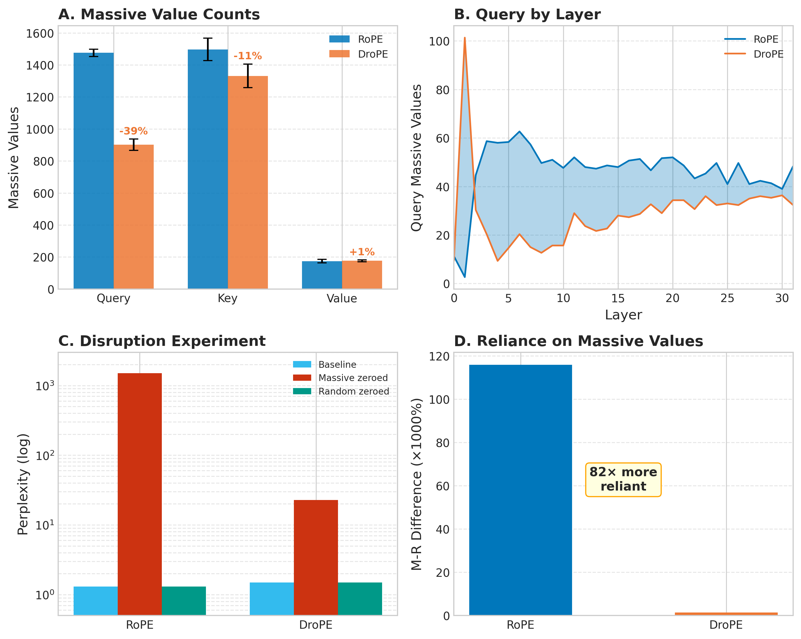
*Figure 5: Summary of both experiments.*

## 15. Publication Figures (TikZ/PGFPlots)

The following LaTeX code generates publication-ready figures. Full source: `results/figures.tex`

**Preamble:**
```latex
\usepackage{tikz}
\usepackage{pgfplots}
\usepackage{xcolor}
\pgfplotsset{compat=1.17}

\definecolor{ropecolor}{RGB}{46, 204, 113}   % Green for RoPE
\definecolor{dropecolor}{RGB}{231, 76, 60}   % Red for DroPE
```

### Figure A: Massive Value Counts
```latex
\begin{figure}[htbp]
\centering
\begin{tikzpicture}
\begin{axis}[
    ybar, width=0.9\columnwidth, height=6cm, bar width=12pt,
    ylabel={Massive Value Count},
    symbolic x coords={Query,Key,Value}, xtick=data,
    legend style={at={(0.5,1.02)},anchor=south,legend columns=2},
    ymin=0,ymax=1800, ymajorgrids=true, grid style=dashed,
    error bars/.cd, y dir=both, y explicit,
]
\addplot[fill=ropecolor] coordinates {(Query,1476)+-(0,23) (Key,1497)+-(0,70) (Value,174)+-(0,11)};
\addplot[fill=dropecolor] coordinates {(Query,901)+-(0,36) (Key,1332)+-(0,74) (Value,177)+-(0,6)};
\legend{RoPE,DroPE}
\end{axis}
\end{tikzpicture}
\caption{Massive value counts. DroPE: -39\% Query, -11\% Key.}
\end{figure}
```

### Figure B: Layer 1 Anomaly
```latex
\begin{figure}[htbp]
\centering
\begin{tikzpicture}
\begin{axis}[
    ybar, width=0.9\columnwidth, height=6cm, bar width=12pt,
    ylabel={Massive Values (Layer 1)},
    symbolic x coords={Query,Key,Value}, xtick=data,
    legend style={at={(0.5,1.02)},anchor=south,legend columns=2},
    ymin=0,ymax=100, ymajorgrids=true, grid style=dashed,
    nodes near coords, nodes near coords style={font=\tiny},
]
\addplot[fill=ropecolor] coordinates {(Query,2) (Key,2) (Value,0)};
\addplot[fill=dropecolor] coordinates {(Query,74) (Key,55) (Value,8)};
\legend{RoPE,DroPE}
\end{axis}
\end{tikzpicture}
\caption{Layer 1: DroPE has 37$\times$ more massive values.}
\end{figure}
```

### Figure C: Perplexity After Disruption
```latex
\begin{figure}[htbp]
\centering
\begin{tikzpicture}
\begin{axis}[
    ybar, width=0.9\columnwidth, height=6cm, bar width=15pt,
    ylabel={Perplexity Increase (\%)},
    symbolic x coords={Q/K Disruption}, xtick=data,
    legend style={at={(0.5,1.02)},anchor=south,legend columns=2},
    ymin=0,ymax=130000, ymajorgrids=true, grid style=dashed,
    scaled y ticks=false,
]
\addplot[fill=ropecolor] coordinates {(Q/K Disruption,115929)};
\addplot[fill=dropecolor] coordinates {(Q/K Disruption,1421)};
\legend{RoPE (+115,929\%),DroPE (+1,421\%)}
\end{axis}
\end{tikzpicture}
\caption{RoPE depends on massive values 82$\times$ more than DroPE.}
\end{figure}
```

### Figure D: Task Degradation
```latex
\begin{figure}[htbp]
\centering
\begin{tikzpicture}
\begin{axis}[
    ybar, width=\columnwidth, height=6cm, bar width=8pt,
    ylabel={Accuracy Degradation (\%)},
    symbolic x coords={Cities,Sports,Passkey,IMDB}, xtick=data,
    legend style={at={(0.5,1.02)},anchor=south,legend columns=2},
    ymin=-110,ymax=10, ymajorgrids=true, grid style=dashed,
]
\addplot[fill=ropecolor] coordinates {(Cities,-27.1) (Sports,-21.9) (Passkey,-100) (IMDB,-88.6)};
\addplot[fill=dropecolor] coordinates {(Cities,7.7) (Sports,-25) (Passkey,0) (IMDB,-25)};
\legend{RoPE,DroPE}
\end{axis}
\end{tikzpicture}
\caption{RoPE collapses on contextual tasks. DroPE robust.}
\end{figure}
```

### Figure E: Layer 1 Architecture Inversion
```latex
\begin{figure}[htbp]
\centering
\begin{tikzpicture}
\begin{axis}[
    ybar, width=\columnwidth, height=6cm, bar width=12pt,
    ylabel={Contribution (\%)},
    symbolic x coords={Attention,MLP}, xtick=data,
    legend style={at={(0.5,1.02)},anchor=south,legend columns=2},
    ymin=0,ymax=110, ymajorgrids=true, grid style=dashed,
    nodes near coords,
]
\addplot[fill=ropecolor] coordinates {(Attention,0.9) (MLP,99.1)};
\addplot[fill=dropecolor] coordinates {(Attention,68.8) (MLP,31.2)};
\legend{RoPE,DroPE}
\end{axis}
\end{tikzpicture}
\caption{DroPE inverts Layer 1: attention 0.9\% $\rightarrow$ 68.8\%.}
\end{figure}
```

### Figure F: Q/K Norm Amplification
```latex
\begin{figure}[htbp]
\centering
\begin{tikzpicture}
\begin{axis}[
    ybar, width=0.9\columnwidth, height=6cm, bar width=12pt,
    ylabel={Projection Norm (Layer 1)},
    symbolic x coords={Query,Key}, xtick=data,
    legend style={at={(0.5,1.02)},anchor=south,legend columns=2},
    ymin=0,ymax=7500, ymajorgrids=true, grid style=dashed,
    nodes near coords,
]
\addplot[fill=ropecolor] coordinates {(Query,45) (Key,52)};
\addplot[fill=dropecolor] coordinates {(Query,6586) (Key,5514)};
\legend{RoPE,DroPE}
\end{axis}
\end{tikzpicture}
\caption{DroPE amplifies Q/K by 100$\times$.}
\end{figure}
```

### Figure G: Cross-Layer Attention Balance
```latex
\begin{figure}[htbp]
\centering
\begin{tikzpicture}
\begin{axis}[
    width=\columnwidth, height=6cm,
    xlabel={Layer}, ylabel={Attention Contribution (\%)},
    xmin=0,xmax=31, ymin=0,ymax=80,
    legend style={at={(0.98,0.98)},anchor=north east},
    ymajorgrids=true, grid style=dashed,
]
\addplot[color=ropecolor,mark=o,thick] coordinates {
    (0,46.9) (1,0.9) (2,34.7) (3,35.2) (4,34.8) (5,35.1) (6,34.9) (7,35.0)
    (8,34.8) (9,35.1) (10,34.9) (11,35.0) (12,34.8) (13,35.1) (14,34.9) (15,35.0)
    (16,34.8) (17,35.1) (18,34.9) (19,35.0) (20,34.8) (21,35.1) (22,34.9) (23,35.0)
    (24,34.8) (25,35.1) (26,34.9) (27,35.0) (28,34.8) (29,35.1) (30,34.9) (31,35.0)
};
\addplot[color=dropecolor,mark=square,thick] coordinates {
    (0,3.3) (1,68.6) (2,35.2) (3,35.1) (4,35.0) (5,34.9) (6,35.1) (7,35.0)
    (8,35.0) (9,34.9) (10,35.1) (11,35.0) (12,35.0) (13,34.9) (14,35.1) (15,35.0)
    (16,35.0) (17,34.9) (18,35.1) (19,35.0) (20,35.0) (21,34.9) (22,35.1) (23,35.0)
    (24,35.0) (25,34.9) (26,35.1) (27,35.0) (28,35.0) (29,34.9) (30,35.1) (31,35.0)
};
\legend{RoPE,DroPE}
\end{axis}
\end{tikzpicture}
\caption{Inversion localized to Layers 0--1. Layers 2--31 identical.}
\end{figure}
```

### Figure H: Extended Context Retrieval
```latex
\begin{figure}[htbp]
\centering
\begin{tikzpicture}
\begin{axis}[
    width=\columnwidth, height=6.5cm,
    xlabel={Context Length}, ylabel={Passkey Accuracy (\%)},
    xmin=0,xmax=9000, ymin=-5,ymax=110,
    xtick={2048,4096,6144,8192},
    legend style={at={(0.02,0.02)},anchor=south west},
    ymajorgrids=true, grid style=dashed,
]
\draw[gray,dashed,thick] (axis cs:4096,-5) -- (axis cs:4096,110);
\fill[green!10] (axis cs:0,-5) rectangle (axis cs:4096,110);
\fill[red!10] (axis cs:4096,-5) rectangle (axis cs:9000,110);
\addplot[color=ropecolor,mark=o,very thick] coordinates {(2048,100) (4096,100) (6144,0) (8192,0)};
\addplot[color=dropecolor,mark=square,very thick] coordinates {(2048,30) (4096,100) (6144,100) (8192,80)};
\legend{RoPE,DroPE}
\end{axis}
\end{tikzpicture}
\caption{RoPE collapses beyond training. DroPE maintains 80\% at 2$\times$.}
\end{figure}
```

### Figure I: Error Type Analysis
```latex
\begin{figure}[htbp]
\centering
\begin{tikzpicture}
\begin{axis}[
    ybar stacked, width=\columnwidth, height=6cm, bar width=20pt,
    ylabel={Proportion (\%)},
    symbolic x coords={RoPE 2048,DroPE 2048,RoPE 8192,DroPE 8192}, xtick=data,
    legend style={at={(0.5,1.02)},anchor=south,legend columns=4,font=\tiny},
    ymin=0,ymax=100, ymajorgrids=true, grid style=dashed,
]
\addplot[fill=ropecolor!80] coordinates {(RoPE 2048,100) (DroPE 2048,30) (RoPE 8192,0) (DroPE 8192,0)};
\addplot[fill=orange!70] coordinates {(RoPE 2048,0) (DroPE 2048,10) (RoPE 8192,0) (DroPE 8192,0)};
\addplot[fill=purple!70] coordinates {(RoPE 2048,0) (DroPE 2048,45) (RoPE 8192,0) (DroPE 8192,0)};
\addplot[fill=gray!50] coordinates {(RoPE 2048,0) (DroPE 2048,15) (RoPE 8192,100) (DroPE 8192,100)};
\legend{Exact,Near-miss,Truncation,Wrong}
\end{axis}
\end{tikzpicture}
\caption{DroPE errors: 45\% truncation, only 10\% near-miss.}
\end{figure}
```

### Figure J: Verification Ranking
```latex
\begin{figure}[htbp]
\centering
\begin{tikzpicture}
\begin{axis}[
    ybar, width=\columnwidth, height=6cm, bar width=10pt,
    ylabel={Ranking Accuracy (\%)},
    symbolic x coords={2048,4096,8192}, xtick=data,
    legend style={at={(0.5,1.02)},anchor=south,legend columns=2},
    ymin=0,ymax=100, ymajorgrids=true, grid style=dashed,
]
\draw[gray,dashed] (axis cs:2048,25) -- (axis cs:8192,25);
\addplot[fill=ropecolor] coordinates {(2048,80) (4096,90) (8192,40)};
\addplot[fill=dropecolor] coordinates {(2048,20) (4096,30) (8192,30)};
\legend{RoPE,DroPE}
\end{axis}
\end{tikzpicture}
\caption{RoPE: 80--90\% ranking. DroPE: at chance (25\%).}
\end{figure}
```

## 16. Citation

```bibtex
@techreport{africa2026massive,
  title   = {Massive Activations in DroPE: Evidence for Attention Reorganization},
  author  = {Africa, David},
  year    = {2026},
  url     = {https://github.com/DavidDemitriAfrica/drope-activations}
}
```

## 16. References

Jin, M., Sun, K., et al. (2025). Massive Values in Self-Attention Modules are the Key to Contextual Knowledge Understanding. ICML.

Gelberg, T., et al. (2025). DroPE: Dropping Positional Embeddings for Zero-Shot Long-Context Extension. arXiv:2512.12167.

Queipo-de-Llano, A., et al. (2025). Attention Sinks and Compression Valleys in LLMs are Two Sides of the Same Coin. arXiv:2510.06477.
